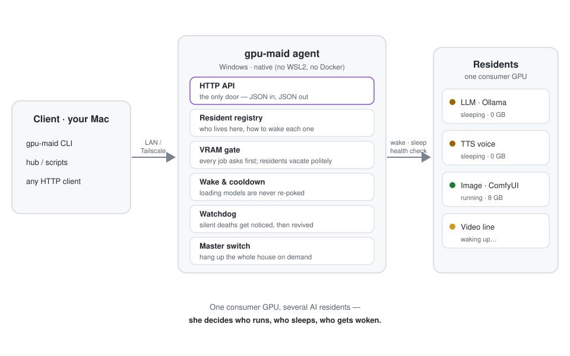

# gpu-maid

[English](README.md) · 简体中文


**你家显卡的女仆——别的产线要上工了，她就哄住户们去睡觉。**

<p align="center">
  
  <br><sub><i>女仆本仆，趁没活儿的空档喝杯咖啡——图出自作者自己的画图产线</i></sub>
</p>

（英文主文档见 [README.md](README.md)，本页为中文速览。）

`gpu-maid` 解决一个常见家庭的烦恼：**一块消费级显卡**（比如 Windows 游戏PC）同时住着
好几个 AI 住户——LLM、TTS 嗓子、画图、视频——而主人想从 Mac 上远程使唤它们。

远程调用本身是大路货：Ollama 有远程端点，ComfyUI 有 API，Tailscale 一拉就通。真正缺的
是**决定谁上工、谁睡觉、谁该被叫醒**的那一层——也就是女仆的活儿。

## 它解决什么问题

一张卡住着好几户，而现在的调度员是**你自己**：

- **显存抢夺战**——两个服务同时上卡，轻则 OOM 报错，重则静默溢出到内存慢三倍，还查不出原因；
- **人肉调度疲劳**——每次切产线全靠手工：退 Ollama、停嗓子、盯 `nvidia-smi`、起视频服务、等权重加载，每切一次 5~10 分钟保姆时间；
- **服务静默暴毙**——常驻模型服务死于 CUDA 错误、杀软误杀、无声崩溃，你是在活儿莫名失败时才发现的；
- **网络之上没有服务层**——Tailscale 只管拉通网络，「谁该睡觉别人才有地方干活」没人管；
- **想回家回不去**——想打游戏了？AI 一家子得挨个进程猎杀。

gpu-maid 就是把这份工作从你手里接走的女仆。

## 一单活儿的流程

<p align="center">
  
</p>

1. 你向 agent 要一个**需要 8 GB 空闲显存**的活儿。
2. 女仆翻住户名册：画图线正在上工，其余住户都睡着。
3. 她把画图线礼貌劝睡，等显存安顿下来。
4. 唤醒目标住户——带冷却窗，模型还在加载时绝不会被二次戳醒。
5. 看门狗全程值守，谁静默暴毙就扶谁起来。
6. 干完了？全家回到休息姿势——或者你拉一下总闸，整个 household 集体歇业。

## 日常循环（目标交互）

装一次就完事：Windows 侧 agent + 住户名册，Mac 侧 CLI 指个地址：

```bash
$ pip install gpu-maid            # 两边都要（v0.1）
$ gpu-maid connect 192.168.1.20   # 把 CLI 指向女仆——一次即可
```

之后一整天就三句话：

```bash
$ gpu-maid list                   # 谁醒着谁睡着，显存还剩多少
$ gpu-maid wake video             # 要房间：女仆清场、安顿、唤醒
# …然后照常用 ComfyUI / Ollama 的原生 API——女仆不碍事
$ gpu-maid master off             # 今天收工——全家歇业
```

看门狗一句吩咐都不需要——你看不看它，它都在值班。

## 跟自带编排的住户怎么相处

ComfyUI 会在步骤之间自己倒腾模型，Ollama 有 `keep_alive`，现代运行时都在自己墙内
管理显存——那是**它们的**本职，gpu-maid 刻意不跟它们抢活。界线这样划：

- **住户体内**（加载哪个模型、何时卸载）——住户自己说了算；
- **住户之间**（别人要显存时，谁还有资格占着卡）——女仆说了算。

注册表里的三档「听话等级」把共存写成明文：

| protocol      | 「睡」的动作                     | 例子                                            |
| ------------- | -------------------------------- | ----------------------------------------------- |
| `cooperative` | 调它的卸载 API，进程留驻          | ComfyUI（`POST /free`）、Ollama（`keep_alive: 0`） |
| `process`     | 停进程；唤醒 = 启动命令           | 裸模型服务                                       |
| `always_on`   | 永不驱逐——计入基线               | 桌面挂件、驱动                                    |

门禁是闭环的：只信 **nvidia-smi 实测**的空闲显存，不信任何人的口头承诺——礼貌驱逐
之后显存还没安顿下来？按住户允许的阶梯升级（卸载 API → 停进程）。

住户自己的队列自己排：你直接往 ComfyUI 界面里塞的活儿是它自己的事。只有当有人向
女仆要显存时，她才出手。

## 配置长什么样

> 形状预览——v0.1 的 schema 还在收敛。

```yaml
residents:
  llm:
    protocol: cooperative            # 睡 = 卸载 API（keep_alive: 0），进程留驻
    vram_gb: 5
  image:
    protocol: cooperative            # 睡 = POST /free —— ComfyUI 保留队列和界面
    endpoint: http://127.0.0.1:8188
    vram_gb: 8
  voice:
    protocol: process                # 睡 = 停进程；醒 = 启动命令
    vram_gb: 4
policies:
  baseline_gb: 1                     # CUDA 上下文与 always_on 住户
  vram_free_need_gb: 8               # 每单活儿先过这道门禁
  load_cooldown_s: 90                # 加载中的模型不被反复戳
  settle_timeout_s: 120              # 没安顿好？按协议阶梯升级
```

## 组件

| 部件      | 跑在哪                       | 干什么                                                                 |
| --------- | ---------------------------- | ---------------------------------------------------------------------- |
| `agent/`  | Windows（原生，免 WSL2/Docker） | HTTP API · 住户名册 · 显存门禁 · 唤醒/冷却 · 看门狗 · 总闸                |
| `cli/`    | macOS 或任意机器              | 薄客户端：`connect / list / wake / ensure / sleep / touch / events / master` |
| 桌面组件  | macOS 菜单栏 · Windows 托盘   | SwiftBar 插件 + PowerShell 托盘点（零依赖脚本）                             |
| 传输      | 局域网 / Tailscale            | 故意做得无聊                                                             |

文档（英文）：[安装运行](docs/install.md) · [配置参考](docs/configuration.md) · [HTTP API](docs/api.md)

## 教你的 agent 用（SKILL.md）

2026 年，GPU 机的操作者有一大半是 agent。给他们发一份家规：

```bash
# clone 本仓，然后把技能拷进你运行时的技能目录
cp -r skills/gpu-maid ~/.claude/skills/    # Claude Code / ZCode 等认识 SKILL.md 的运行时
```

技能里教的是循环（`list → wake → 原生 API → sleep`），更重要的是家规：agent
绝不许绕开女仆直接杀住户进程；主人不开口，就不许拉总闸。

## 什么时候不需要它

- 卡上只住一个服务——没有竞争，就没有痛点；
- worker 是 Linux 机器——那个世界有 GPUStack 们伺候；
- 纯云端工作流——家里没有要照看的卡。

## 状态

🚧 v0.1 开发中。agent / CLI / 示例配置 / 文档 / macOS 菜单栏插件已落地，
**已在真实 Windows 显卡机（RTX 4070S）上通过 15/15 项真机验证**
（GPU 上运行 `python scripts/validate_on_pc.py` 可随时回归）。剩余：Demo GIF、
PyPI 发布。

## 范围与支持

作者环境（NVIDIA + Windows 游戏PC + 国产杀软在场）日产实测；其余显卡、驱动、环境
均未测试——一切 **as-is**，欢迎提 issue，欢迎提 patch，patch 来得更快。

## License

[Apache-2.0](LICENSE)
